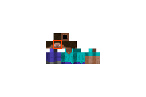
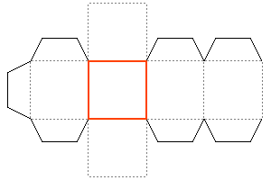

# Pixel Papercraft Generator Builder

## Getting started

### First time setup

Install Node v14 and Git.

Node is best installed using [Node Version Manager](https://github.com/nvm-sh/nvm).

Once you have NVM installed, then install Node v14:

```sh
nvm install 14.16.0
```

Install Git [from the official site](https://git-scm.com/downloads).

Clone this repository and install the dependencies:

```sh
cd <parent_folder_for_the_generator_builder>
git clone https://github.com/pixelpapercraft/pixel-papercraft-generator-builder generator-builder
cd generator-builder
npm install
```

### Set up ReScript and Visual Studio Code

Generators are developed using the [ReScript](https://rescript-lang.org/) programming language.

ReScript development is best done using [Visual Studio Code](https://code.visualstudio.com/).

After installing VSCode, then install the official ReScript extension `rescript-vscode` from the VSCode Extensions panel.

### Development

Ensure you are running the correct version of Node:

```
nvm use
```

In one terminal, start the ReScript compiler:

```
npm run res:watch
```

In another terminal, start the web server:

```
npm start
```

Then open your browser:

```
http://localhost:3000
```

## Example Generator

This is a quick example of what a simple generator script might look like.

This will be explained further in the sections below.

```res
// Unique id for the generator
let id = "face-generator"

// Name for the generator
let name = "Face Generator"

// Array of image URLs the generator may use
let images: array<Generator.imageDef> = [
  {
    id: "Background",
    url: Generator.require("./images/Background.png"),
  }
]

// Array of texture URLs the generator may use
let textures: array<Generator.textureDef> = [
  {
    id: "Skin",
    url: Generator.require("./textures/Skin.png"),
    standardWidth: 64,
    standardHeight: 64,
  },
]

// The generator script
let script = () => {
  Generator.drawImage("Background", (0, 0))

  let ox = 74
  let oy = 25
  Generator.drawTexture(
    "Skin",
    (16, 8, 8, 8),
    (ox + 128, oy + 64, 64, 64),
    ()
  )
}

// Export the generator details
let generator: Generator.generatorDef = {
  id: id,
  name: name,
  images: images,
  textures: textures,
  script: script,
}
```

## Developing generators

Code for generators is in the `src/generators` directory.

You can use any directory structure you like for each generator, but a recommended structure is:

```
/example
  /images
  /textures
  /Example.res
```

Each generator should export a property named `generator` that has the type `Generator.generatorDef`. For example:

```res
let generator: Generator.generatorDef = {
  id: id,
  name: name,
  images: images,
  textures: textures,
  script: script,
}
```

These properties are:

| Property | Description                                  |
| -------- | -------------------------------------------- |
| id       | Unique Id for the generator, used in the URL |
| name     | Name for the generator                       |
| images   | Array of image URLs                          |
| textures | Array of texture image URLs                  |
| script   | Generator script                             |

Lastly, add the generator to the `src/generators/Generators.res` file.

```res
let generators = [
  Example.generator,
]
```

## Images vs Textures

**Images** are just simple images that can be drawn onto the pages. You cannot draw parts of images, you can only draw the whole image. This makes them very fast to draw. You will typically use images for things like backgrounds and folds.

**Textures** are used when you want to draw parts of an image onto the page and those parts may be scaled, flipped or rotated, etc. Textures are slow to draw because of the image processing needed.

## Generator Programming Guide

### Loading images

Images needed by the generator are specified as an array of `Generator.imageDef`.

Note that the `url` property of the images must be created with `Generator.require()`.

```res
let images: array<Generator.imageDef> = [
  {
    id: "Background",
    url: Generator.require("./images/Background.png"),
  },
  {
    id: "Folds",
    url: Generator.require("./images/Folds.png"),
  },
]
```

### Loading textures

Textures needed by the generator are specified as an array of `Generator.textureDef`.

Note that the `url` property of the textures must be created with `Generator.require()`.

Also note that textures must specify a `standardWidth` and `standardHeight`. This allows higher resolution versions of those textures to also work.

```res
let textures: array<Generator.textureDef> = [
  {
    id: "Skin",
    url: Generator.require("./textures/Skin.png"),
    standardWidth: 64,
    standardHeight: 64,
  },
]
```

### Writing the script

The script should be specified as the `script` property of the generator.

```res
let script = () => {
  Generator.drawImage("Background", (0, 0))
}
```

### Defining Inputs for Textures

Use the `defineTextureInput` function.

You must also specify some options:

- `standardWidth` and `standardHeight` - the default width and height of the texture. These are required so that higher resolution textures will work.
- `choices` - an array of texture names that may be selected instead of selecting a texture file. Specify an empty array `[]` if none required.

```res
Generator.defineTextureInput(
  "Skin",
  {
    standardWidth: 64,
    standardHeight: 64,
    choices: ["Steve", "Alex"]
  }
)
```

### Drawing images

Use the `Generator.drawImage()` function.

To draw an image at position `x` = `0` and `y` = `0`:

```res
Generator.drawImage("Background", (0, 0))
```

To draw an image at position `x` = `50` and `y` = `100`:

```res
Generator.drawImage("Background", (50, 100))
```

### Drawing textures

Drawing a texture means that you want to copy a rectangle from the texture onto the page.

To do this, you need to:

1. Identify the x, y coordinates plus width and height of a rectangle on the texture to copy
2. Identify the x, y coordinates plus width and height of a rectangle on the page to draw it into

For example, suppose we want to copy the face from the following texture onto the page.



This is a rectangle (a square in this case) with the following coordinates and size:

```
x = 8
y = 8
width = 8
height = 8
```

In ReScript we will write these coordinates as:

```res
(8, 8, 8, 8)
```

Next, we need to identify the rectange on the page.



It needs to draw onto the page as a bigger rectangle with the following coordinates and size:

```
x = 138
y = 89
width = 64
height = 64
```

In ReScript we write this as:

```res
(138, 89, 64, 64)
```

Also suppose the name of the texture is `Skin`, then to draw this texture onto the page we would write:

```res
Generator.drawTexture(
  "Skin",
  (8, 8, 8, 8),
  (138, 89, 64, 64),
  (),
);
```

### Rotating textures

When using `Generator.drawTexture()` you can rotate textures using the `~rotate` argument.

The `~rotate` argument can be any `float` value.

```res
Generator.drawTexture(
  "Skin",
  (8, 8, 8, 8),
  (138, 89, 64, 64),
  ~rotate=90.0,
  (),
);
```

### Flipping textures

When using `Generator.drawTexture()` you can flip textures using the `~flip` argument.

The `~flip` argument can be either `~flip=#Horizontal` or `~flip=#Vertical`.

```res
Generator.drawTexture(
  "Skin",
  (8, 8, 8, 8),
  (138, 89, 64, 64),
  ~flip=#Vertical,
  (),
);
```

### Blending colors

When using `Generator.drawTexture()` you can blend textures with a color using the `~blend` argument.

This is useful when adding a tint to certain blocks in Minecraft corresponding to a biome.

The `~blend` argument can be either:

- `#None` meaning no blend.
- `#MultiplyHex(string)` for a hex string, such as `#MultiplyHex("#90814D")`.
- `#MultiplyRGB(int, int, int)` for red, green and blue values from 0 to 255, such as `#MultiplyRGB(144, 129, 77)`.

```res
Generator.drawTexture(
  "Skin",
  (8, 8, 8, 8),
  (138, 89, 64, 64),
  ~blend=#MultiplyHex("#90814D"),
  (),
);
```

### Using multiple pages

By default the generator gives you one blank page to work with, however some designs may require more than one page.

To specify additional pages you can use the `Generator.usePage()` function. You just have to choose a name for each page, which can be any name you like.

```res
// Choose the first page
Generator.usePage("Head and Body");

// Draw images and textures here

// Choose the next page
Generator.usePage("Legs");

// Draw images and textures here
```

If each page doesn't have a specific purpose, just call them "Page 1", "Page 2", etc.

```res
// Choose the first page
Generator.usePage("Page 1");

// Draw images and textures here

// Then choose the next page
Generator.usePage("Page 2");

// Draw images and textures here
```

### Getting user input

It's sometimes useful to give your user some choices in your generator.

For example, some people want the fold lines, and others don't, or your generator might have list of weapons they can choose from.

#### Boolean inputs

Boolean inputs provide a `true` or `false` choice. They may be used to show or hide certain parts of your generator.

Use `Generator.defineBooleanInput()` to create boolean inputs.

```res
Generator.defineBooleanInput("Show Folds", true) // Initially true
Generator.defineBooleanInput("Show Labels", true) // Initially true
```

To use these values use `Generator.getBooleanInputValue()`

```res
let showFolds = Generator.getBooleanInputValue("Show Folds");
let showLabels = Generator.getBooleanInputValue("Show Labels");

if (showFolds) {
  Generator.drawImage("Folds", (0, 0));
}

if (showLabels) {
  Generator.drawImage("Labels", (0, 0));
}
```

#### Select inputs

Select variables let your user choose from a list of values that you provide.

Use `Generator.defineSelectInput()` to create select inputs.

```res
Generator.defineSelectInput("Weapon", ["None", "Sword", "Crossbow"])
```

To use these values use `Generator.getSelectInputValue()`

```res
let weapon = Generator.getSelectInputValue("Weapon");

if weapon === "Sword" {
  Generator.drawImage("Sword", (100, 100))
} else if weapon === "Crossbow" {
  Generator.drawImage("Crossbow", (100, 100))
}
```

Or an alternative syntax:

```res
let weapon = Generator.getSelectInputValue("Weapon");

switch weapon {
  | "Sword" => Generator.drawImage("Sword", (100, 100))
  | "Crossbow" => Generator.drawImage("Crossbow", (100, 100))
  | _ => () // All other values, do nothing
}
```

### Defining clickable regions

You can define clickable regions on your pages, and what actions should occur when a region is clicked.

Clickable regions are defined using the `Generator.defineRegionInput(region, onClick)` function.

For example, you could toggle a variable using a clickable region.

```res
// Define the input
Generator.defineBooleanInput("Show overlay", false)

// Get the input value
let showOverlay = Generator.getBooleanInputValue("Show overlay")

let region = (0, 0, 100, 100)
let onClick = () => {
  // Toggle the input value
  Generator.setBooleanInputValue("Show overlay", !showOverlay)
}

// Define the clickable region
Generator.defineRegionInput(region, onClick)
```

But this could be written more concisely as:

```res
Generator.defineBooleanInput("Show overlay", false)
let showOverlay = Generator.getBooleanInputValue("Show overlay")

Generator.defineRegionInput((0, 0, 100, 100), () => {
  Generator.setBooleanInputValue("Show overlay", !showOverlay)
})
```

### Providing instructions or comments

You can provide some text instructions and comments with your inputs using `Generator.defineText()`.

```res
Generator.defineText("Click body parts to change the texture.")
```
